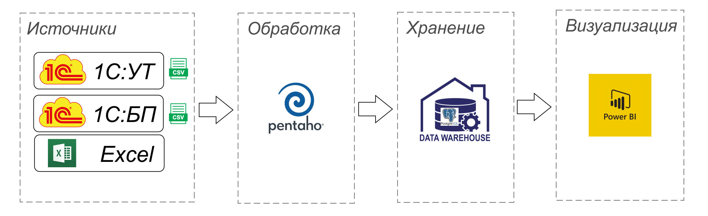
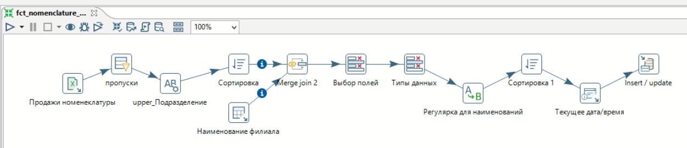
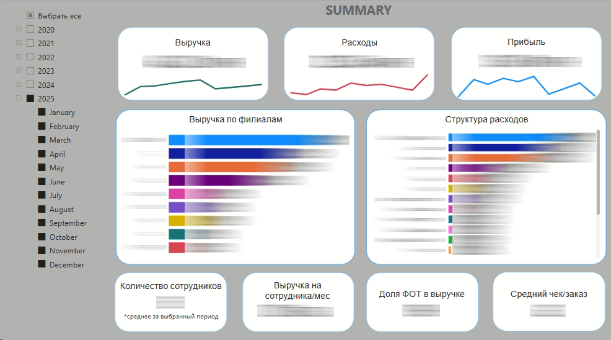
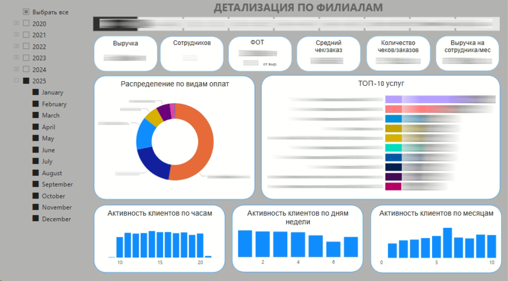
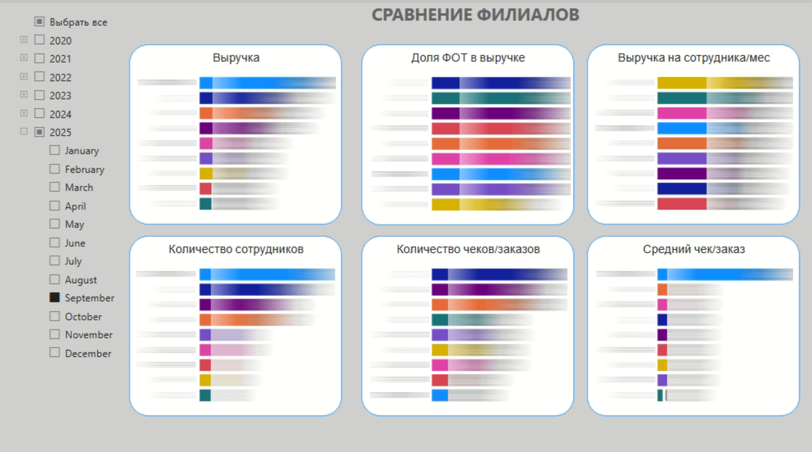

# 📊 Data Warehouse + BI система для аналитической отчетности

## 🚀 Описание проекта

Кейс построения полной аналитической системы с нуля:  
от сбора данных из разрозненных источников до построения интерактивной BI-отчетности для бизнеса.

---

## 🎯 Цель

Автоматизировать сбор, обработку и анализ данных,  
заменив ручную отчетность на единую систему с актуальными метриками для руководства.

---

## ⚠️ Проблема (до внедрения)

- Данные хранились в разных источниках (1С, Excel)
- Отчеты формировались вручную
- Не было единой версии данных
- Долгое время подготовки отчетности

---

## 🛠️ Решение

### 1. Источники данных
- 1С: Управление торговлей
- 1С: Бухгалтерия
- Excel-файлы (ручной ввод)

Организована регулярная выгрузка данных.

---

### 2. ETL-процессы (Pentaho Data Integration)

Реализованы процессы:
- загрузки данных
- очистки и нормализации
- удаления дублей
- объединения данных из разных источников
- обогащения данных

---

### 3. Хранилище данных (DWH)

- PostgreSQL
- Спроектирована структура хранения
- Настроена регулярная загрузка из ETL

---

### 4. BI-аналитика (Power BI)

- Построена модель данных
- Реализованы метрики (DAX)
- Созданы интерактивные дашборды:

---

## 📈 Результат

- 📉 Существенно сокращено время подготовки отчетности
- 📊 Руководство получило доступ к актуальным данным в любое время
- ✅ Повышено качество данных (снижение ошибок и расхождений)
- 🔄 Создан единый источник аналитических данных (DWH)

---

## 🧠 Моя роль

- Полностью самостоятельно реализовал проект
- Спроектировал архитектуру системы
- Разработал ETL-процессы
- Построил DWH
- Создал BI-отчетность
- Взаимодействовал с бизнесом и собирал требования

---

## 🧰 Технологии

- PostgreSQL
- Pentaho Data Integration
- Power BI (DAX, Power Query)
- Excel
- 1С

---

## 🗂️ Архитектура

---

## ⚙️ Пример ETL процесса

---

## 📊 Примеры отчетов

---

## 💡 Вывод

Проект демонстрирует опыт построения end-to-end аналитики:
от работы с сырыми данными до визуализации и передачи результатов бизнесу.

